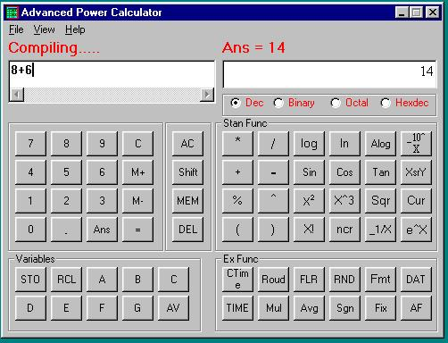



## Advanced power calculator

### Description

This program is developed in Visual Basic 6.0. It is nothing but scientfic calculator. Here i designed a library for calculation. use this program for only studying purpose. if you want the executable visit www.picksourcecode.com
 
### More Info
 

             |
---                |---
**Submitted On**   |2007-01-11 23:04:34
**By**             |[macRatheesh](https://github.com/Planet-Source-Code/PSCIndex/blob/master/ByAuthor/macratheesh.md)
**Level**          |Beginner
**User Rating**    |4.4 (31 globes from 7 users)
**Compatibility**  |VB 6\.0
**Category**       |[Math/ Dates](https://github.com/Planet-Source-Code/PSCIndex/blob/master/ByCategory/math-dates__1-37.md)
**World**          |[Visual Basic](https://github.com/Planet-Source-Code/PSCIndex/blob/master/ByWorld/visual-basic.md)
**Archive File**   |[Advanced\_p2043571202007\.zip](https://github.com/Planet-Source-Code/macratheesh-advanced-power-calculator__1-67684/archive/master.zip)

